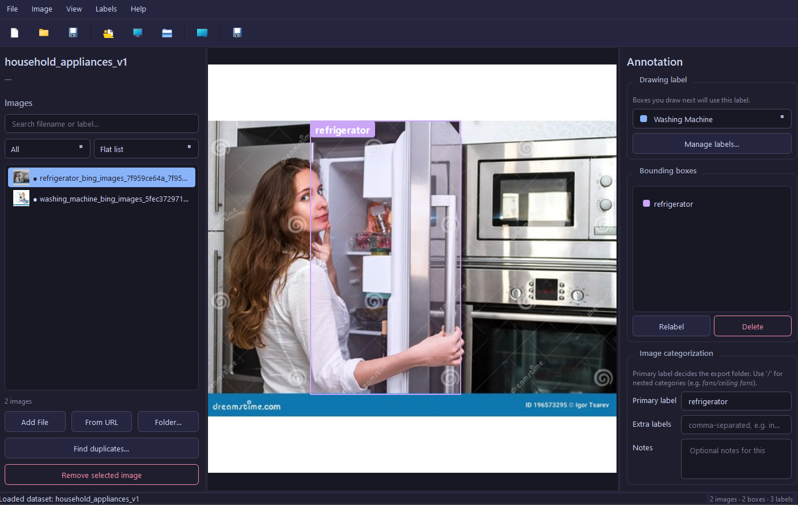
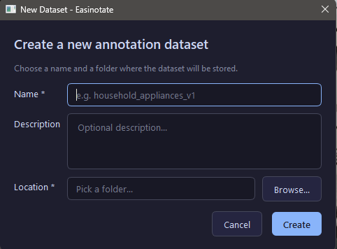
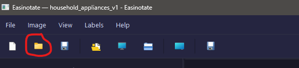
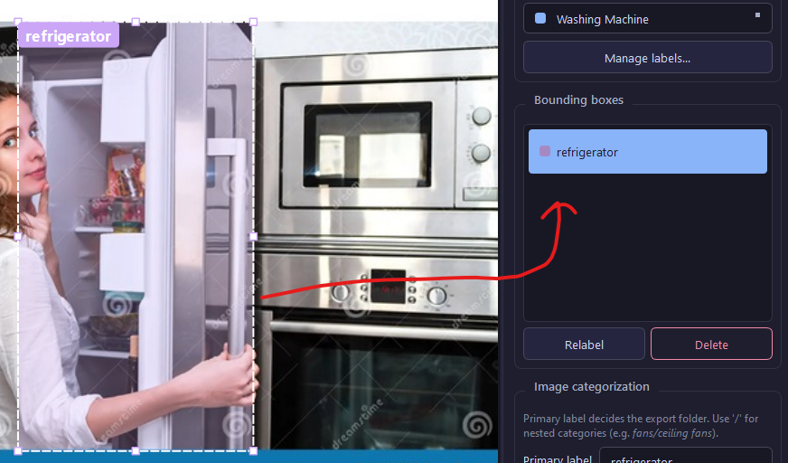
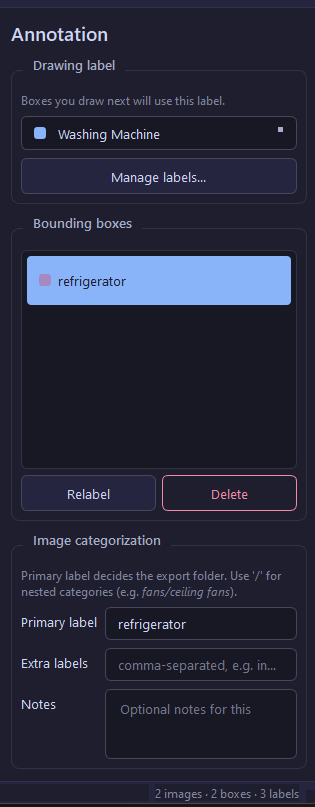
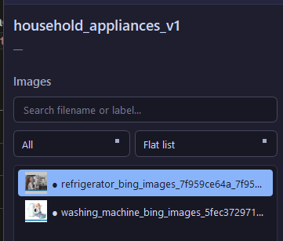
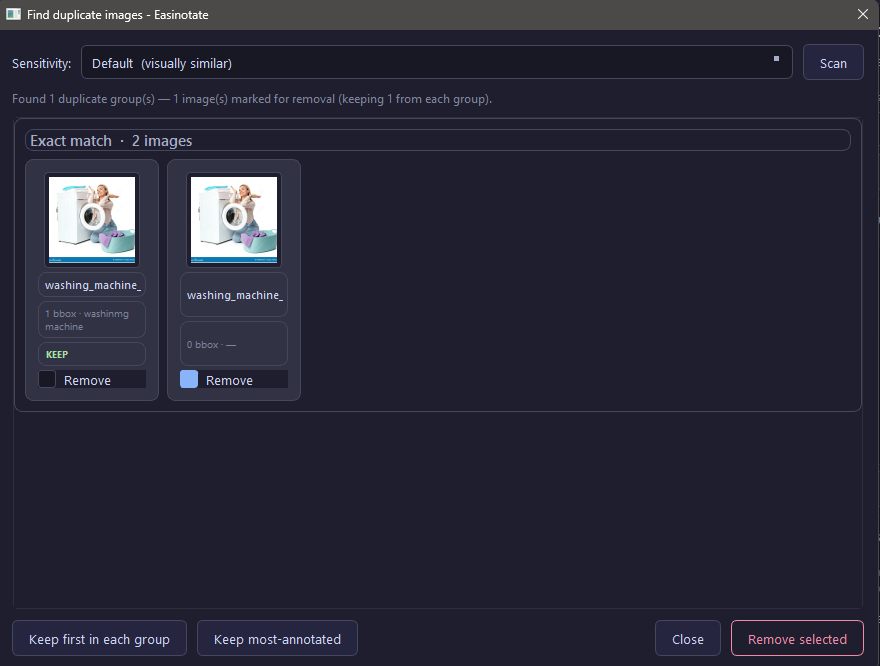
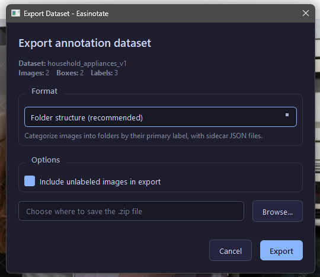
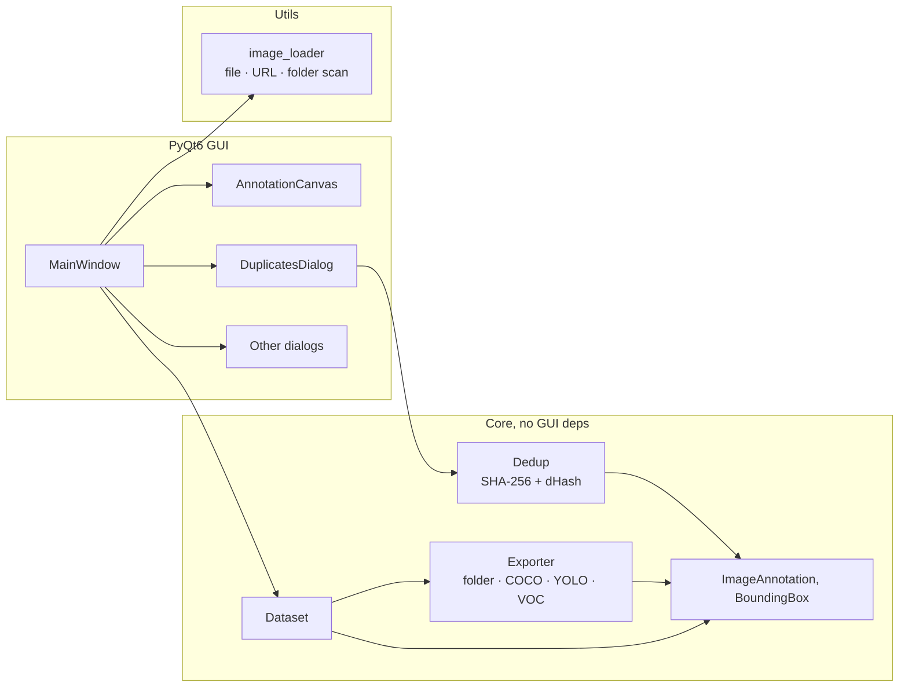

<div align="center">


# Easinotate

**A modern, lightweight image-annotation desktop app for building computer-vision datasets.**

Draw bounding boxes, label images, organise them into hierarchical folders, find and remove duplicates, and export to industry-standard formats — all from a clean PyQt6 desktop UI.

[](#)
[](#)
[](LICENSE)
[](#)
[](#contributing)

<br>



</div>

---

<details>
<summary><b>Table of contents</b></summary>

- [Why Easinotate?](#why-easinotate)
- [Features](#features)
- [Installation](#installation)
- [Tutorial](#tutorial)
  - [1. Create a dataset](#1-create-a-dataset)
  - [2. Import images](#2-import-images)
  - [3. Draw and label bounding boxes](#3-draw-and-label-bounding-boxes)
  - [4. Categorise with primary labels](#4-categorise-with-primary-labels)
  - [5. Search, filter and group](#5-search-filter-and-group)
  - [6. Find and remove duplicates](#6-find-and-remove-duplicates)
  - [7. Export your dataset](#7-export-your-dataset)
- [Reference](#reference)
  - [Dataset format on disk](#dataset-format-on-disk)
  - [Export formats](#export-formats)
  - [Keyboard shortcuts](#keyboard-shortcuts)
  - [Project structure](#project-structure)
- [Architecture](#architecture)
- [Building from source](#building-from-source)
- [Contributing](#contributing)
- [Roadmap](#roadmap)
- [License](#license)

</details>

---

## Why Easinotate?

Most existing annotation tools are either heavy web platforms that need a server, or they bake your work into a proprietary format you can't easily move between projects.

Easinotate is the in-between:

-  **Single binary, no server** — runs as a Windows `.exe`, no Python required for end users.
-  **Plain-folder datasets** — `dataset.json` + an `images/` folder. Diff it, version-control it, copy it to another machine. No vendor lock-in.
-  **Built around hierarchical categorisation** — your folder structure *is* your taxonomy.
-  **Export to whatever your model needs** — COCO, YOLO, Pascal VOC, or just clean folders.
-  **Built-in duplicate detection** — perceptual hashing finds re-encodes and near-duplicates, not just exact matches.

---

## Features

| | |
|---|---|
|  **Bounding boxes** | 8-handle resize, drag-to-move, draw with one click+drag |
|  **Labels** | Per-bbox labels, per-image labels, with auto-coloured palette |
|  **Hierarchical taxonomy** | Slash-separated primary labels become export folders (`fans/ceiling`, `cookers/large`) |
|  **Bulk folder import** | Recursive scan, optionally use folder names as primary labels |
|  **Search & filter** | Live search across filenames + labels, plus filter by annotation status |
|  **Duplicate detection** | Exact (SHA-256) + near-duplicate (perceptual dHash) with review UI |
|  **URL imports** | Drop in remote images by URL |
|  **Multi-format export** | Folder structure, COCO JSON, YOLO Darknet, Pascal VOC — each as a self-contained ZIP |
|  **Auto-save** | Atomic writes every 30 seconds; no corrupt files on crash |
|  **Modern dark theme** | Catppuccin-inspired palette, easy on long sessions |
|  **Compact list view** | Hundreds of images in a single screen, with thumbnails |
|  **Keyboard-driven** | All common actions have shortcuts |

---

## Installation

### Option 1 — Pre-built Windows executable (recommended for end users)

Download `Easinotate.exe` from the latest [release](#) and double-click. No Python, no installer, no admin rights.

### Option 2 — Run from source (any OS)

Requires **Python 3.9+**.

```bash
git clone https://github.com/yourname/easinotate.git
cd easinotate
pip install -r requirements.txt
pip install -e .
easinotate
```

Or, without installing:

```bash
python -m easinotate
```

### Option 3 — Build the `.exe` yourself

See [Building from source](#building-from-source).

---

## Tutorial

A guided tour of the full annotation workflow, from empty dataset to exported ZIP.

> 💡 Screenshots below assume a fresh install. Replace each placeholder image at `docs/screenshots/*.png` with a real capture from your build.

### 1. Create a dataset

Launch Easinotate and choose **File → New Dataset…** (or `Ctrl+N`).

<div align="center">
  
</div>

Pick a name (e.g. `appliances`), an optional description, and a parent folder. Easinotate creates:

```
<parent>/appliances/
├── dataset.json   ← all your annotations live here
└── images/        ← imported images get copied here
```

The folder is yours. You can move it, zip it, or commit it to git.

---

### 2. Import images

Easinotate gives you three ways to bring images in.

#### From a single file or selection

**Image → Add image from file…** (`Ctrl+I`). Select one or many at once.

#### From a folder (with optional auto-categorisation)

**Image → Add images from folder…** (`Ctrl+Shift+I`). Two prompts appear:

1. **Recursive scan?** — yes to walk every subfolder, no to import only direct children.
2. **Use folder names as primary labels?** — yes to auto-categorise.

The auto-categorisation feature is the killer move when you already have your images sorted on disk:

```
photos/
├── fans/
│   ├── ceiling/   ← these become primary_label = "fans/ceiling"
│   └── standing/  ← these become primary_label = "fans/standing"
└── cookers/
    └── large/     ← these become primary_label = "cookers/large"
```

A progress dialog tracks the import; failures are summarised at the end rather than nagging you for each one.

<div align="center">
  
</div>

#### From a URL

**Image → Add image from URL…** (`Ctrl+U`). Paste a direct image URL; Easinotate downloads, validates, and stores it locally.

---

### 3. Draw and label bounding boxes

Click an image in the left panel to load it on the canvas.

<div align="center">
  
</div>

- **Drag** anywhere on the canvas to draw a new box. The new box is selected automatically.
- **Click a handle** to resize. Handles appear at the four corners and the four edge midpoints.
- **Drag the body** to move the box.
- **Wheel** to zoom; **middle-mouse drag** to pan; press `F` to fit-to-window.
- **Delete** key removes the selected box.

In the **right-hand properties panel**, type a label for the selected box (e.g. `blade`, `motor`). Labels you've used before show up in the dropdown with their colour swatch — pick from the list to keep colours consistent.

<div align="center">
  
</div>

---

### 4. Categorise with primary labels

The **Primary Label** field on each image is the key to Easinotate's export folder structure. Use forward slashes for nested categories:

```
fans/ceiling-fans
fans/standing-fans
cookers/large-cookers
cookers/portable
```

On export, each image lands in `images/<primary_label>/`. Path components are sanitised automatically.

You can also add **Image-level Labels** (comma-separated, e.g. `indoor, daytime`) and free-form **Notes** for each image.

---

### 5. Search, filter and group

When your dataset grows past a few dozen images, use the controls above the image list.

<div align="center">
  
</div>

- **Search box** — live-matches against filename, primary label, image labels, and bbox labels.
- **Filter dropdown** — show only Annotated / Unannotated / Has primary label / No primary label / From URL.
- **Group dropdown** — flatten by insertion order, or group by primary label with section headers.

The list footer shows `Showing X of Y` so you always know what's hidden.

The list itself uses single-line compact rows with 28 px thumbnails — hundreds of images fit in one screen.

---

### 6. Find and remove duplicates

Click **Find duplicates…** in the left panel (or `Ctrl+D`).

Easinotate runs two passes over every image:

1. **SHA-256** of the file bytes — catches exact duplicates (re-imports, identical copies).
2. **dHash** (8×8 difference hash) — catches near-duplicates: re-encodes, slight crops, brightness shifts, resaves.

<div align="center">
  
</div>

Each group is shown as a strip of thumbnails. The first image in each group is suggested as the **KEEP**; others have a **Remove** checkbox checked by default.

**Sensitivity dropdown:**

| Setting | Hamming distance | What it catches |
|--------|------|-----------------|
| Strict   | ≤ 3  | Exact + nearly-identical |
| Default  | ≤ 6  | Visually similar |
| Loose    | ≤ 10 | Likely-similar (more false positives) |

**Auto-select buttons:**
- **Keep first in each group** — quickest path.
- **Keep most-annotated** — picks the image with the most bboxes / labels / primary set, so you don't lose work you've already done.

Confirm and the chosen images are removed from the dataset and their files deleted from `images/`.

---

### 7. Export your dataset

**File → Export Dataset…** (`Ctrl+E`).

<div align="center">
  
</div>

Pick a format and a destination ZIP. Each export produces one self-contained archive — re-run the export for additional formats.

See [Export formats](#export-formats) below for what each one looks like.

---

## Reference

### Dataset format on disk

A dataset is just a folder. Everything is plain JSON; nothing is binary or proprietary.

```
my-dataset/
├── dataset.json     ← all annotations + metadata, atomically written
└── images/          ← copies of imported images
    ├── img001.jpg
    └── img002.png
```

`dataset.json` is human-readable, gittable, and easy to post-process with `jq`, Python, or anything else.

### Export formats

#### Folder structure (default)

```
<dataset_name>/
├── annotations.json       # full annotations as a flat array
├── README.txt
└── images/
    ├── fans/
    │   ├── ceiling-fans/
    │   │   ├── img001.jpg
    │   │   └── img001.json   # sidecar: bboxes + labels
    │   └── standing-fans/
    │       ├── img002.jpg
    │       └── img002.json
    └── cookers/
        └── large-cookers/
            ├── img003.jpg
            └── img003.json
```

#### COCO JSON

```
<dataset_name>/
├── metadata.json
├── annotations.json   # standard COCO detection format
└── images/            # all images, flat
```

Drop straight into Detectron2, MMDetection, etc.

#### YOLO Darknet

```
<dataset_name>/
├── classes.txt        # one class name per line
├── data.yaml          # ready for ultralytics / YOLOv5 / YOLOv8
├── images/            # all images, flat
└── labels/            # one .txt per image: <class_id> <cx> <cy> <w> <h>
```

#### Pascal VOC

```
<dataset_name>/
├── metadata.json
├── Annotations/       # one .xml per image
└── JPEGImages/        # all images, flat
```

### Keyboard shortcuts

| Action | Shortcut |
|---|---|
| New dataset | `Ctrl+N` |
| Open dataset | `Ctrl+Shift+O` |
| Save dataset | `Ctrl+S` |
| Add image from file | `Ctrl+I` |
| Add images from folder | `Ctrl+Shift+I` |
| Add image from URL | `Ctrl+U` |
| Find duplicates | `Ctrl+D` |
| Export dataset | `Ctrl+E` |
| Manage labels | `Ctrl+L` |
| Delete selected bbox | `Delete` |
| Fit image to window | `F` |
| Zoom in / out | `Ctrl++` / `Ctrl+-` |
| Pan canvas | Middle-mouse drag |

### Project structure

```
easinotate/
├── easinotate/
│   ├── core/                  # data + logic, no GUI deps
│   │   ├── annotation.py        # BoundingBox, ImageAnnotation
│   │   ├── dataset.py           # Dataset save/load, atomic JSON
│   │   ├── exporter.py          # folder / COCO / YOLO / VOC writers
│   │   └── dedup.py             # perceptual hash + dup grouping
│   ├── gui/                   # PyQt6 widgets
│   │   ├── canvas.py            # bbox drawing canvas
│   │   ├── dialogs.py           # new / import / export dialogs
│   │   ├── duplicates_dialog.py # duplicate-review UI
│   │   ├── main_window.py       # top-level window
│   │   └── style.py             # dark-theme stylesheet
│   ├── utils/
│   │   └── image_loader.py      # file & URL importers, folder scanning
│   ├── resources/
│   │   ├── icon.png
│   │   └── icon.ico
│   └── main.py                  # entry point
├── build_tools/
│   ├── build_exe.bat            # Windows build script
│   ├── build_exe.sh             # Linux/macOS build script
│   └── easinotate.spec          # PyInstaller spec
├── docs/
│   └── screenshots/             # README screenshots
├── requirements.txt
├── requirements-dev.txt
├── pyproject.toml
├── setup.py
├── LICENSE
└── README.md
```

---

## Architecture



The split is intentional: `core/` and `utils/` have no PyQt dependency, so they're directly reusable as a library or in a CLI without dragging in the GUI.

---

## Building from source

### Windows

```cmd
python -m venv .venv
.venv\Scripts\activate
pip install -r requirements-dev.txt
build_tools\build_exe.bat
```

The single-file binary appears at `dist\Easinotate.exe`.

### Linux / macOS

```bash
python3 -m venv .venv
source .venv/bin/activate
pip install -r requirements-dev.txt
bash build_tools/build_exe.sh
```

The binary appears at `dist/Easinotate` (Linux) or `dist/Easinotate.app` (macOS).

> ⚠️ PyInstaller produces **platform-native** binaries. To build a Windows `.exe`, run the build on Windows. Cross-compilation isn't supported.

### Troubleshooting

<details>
<summary><code>IndexError: tuple index out of range</code> during PyInstaller build</summary>

This is a Python 3.10 `dis` module bug that PyInstaller's bytecode scanner trips over. Either:

- Upgrade PyInstaller: `pip install --upgrade pyinstaller`, or
- Upgrade to Python 3.11+, or
- Use the patched `easinotate.spec` shipped in `build_tools/` — it monkey-patches the offending function for Python 3.10.

</details>

<details>
<summary><code>ImportError: attempted relative import with no known parent package</code> when running the .exe</summary>

You're running an older `main.py` that uses relative imports (`from .gui...`). Pull the latest version — `main.py` uses absolute imports (`from easinotate.gui...`) which work both inside the package and as a PyInstaller entry script.

</details>

---

## Contributing

PRs welcome. For larger changes, open an issue first to discuss the design.

```bash
git clone https://github.com/yourname/easinotate.git
cd easinotate
python -m venv .venv
source .venv/bin/activate            # or .venv\Scripts\activate on Windows
pip install -r requirements-dev.txt
pip install -e .
```

A quick syntax sanity check before committing:

```bash
python -c "import ast, pathlib; [ast.parse(p.read_text()) for p in pathlib.Path('easinotate').rglob('*.py')]"
```

---

## Roadmap

- [ ] Polygon and keypoint annotations
- [ ] Train / val / test split on export
- [ ] CLI for headless batch operations
- [ ] Dataset diff & merge tools
- [ ] Active-learning loop with a pluggable model backend
- [ ] Multi-user collaboration via a thin sync server
- [ ] Drag-and-drop image import
- [ ] Undo / redo

Have ideas? [Open an issue](#).

---

## License

[MIT](LICENSE) — do whatever you want, just keep the copyright notice.

---

<div align="center">
  <sub>Built with PyQt6 · Pillow · PyInstaller</sub>
  <br>
  <sub>If Easinotate saves you time, give it a ⭐</sub>
</div>